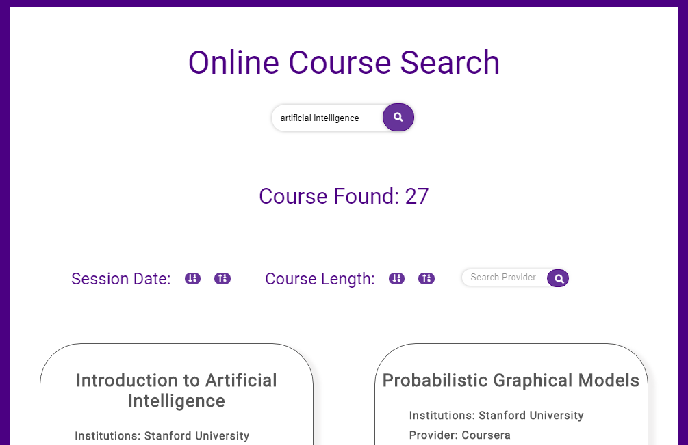

# Byju's Front End Developer Challenge
### Acknowledgement
It is my great pleasure to receive this Front End Developer Challenge by Byju's. This challenge taught me some important things, like what are the expectation of industry from a developer and what will be the mindsetup of a developer.
Thanks to Byju's Team to give me this opportunity.
### OnlineCourseSearch
OnlineCourseSearch application for search courses online. Here, user will give some subject name and search for some courses. And as a result user will get available courses below with details. User can find their course provider , check available courses based on length and session date.
### Author:
Debarun Mitra
### Application Name:
OnlineCourseSearch
### Features:
- User can search providers
- Sort courses based on length
- Sort courses based on Session Date
### Technology Used:
- React Js
- JavaScript ES6
- HTML
- CSS
- Heroku
### Live Review:
[onlinecoursesearch.herokuapp.com](https://onlinecoursesearch.herokuapp.com/)
### **Assumptions:
- At the opening of the project , It will show all courses based on availability of data, means it will show all courses where valid data will be present. It will neglect all blank fields of working data.  
- Sorting of Next Session Data are based on year.
### Installation:
- Step 1: Download the client folder from the repository.
- Step 2: Open client folder in your IDE and terminal. Type below command
**`npm install`**
- Step 3: After completing installation of node modules, Type next command
**`npm start`**
The application will run in the development mode.
Open http://localhost:3000 to view it in the browser.
### ScreenShot:

